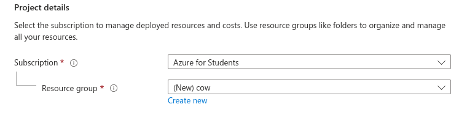
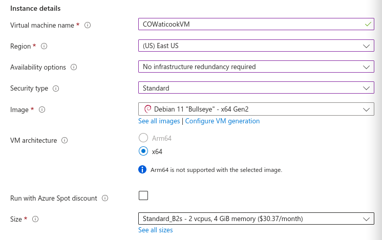
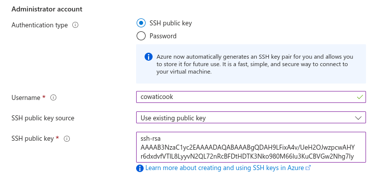
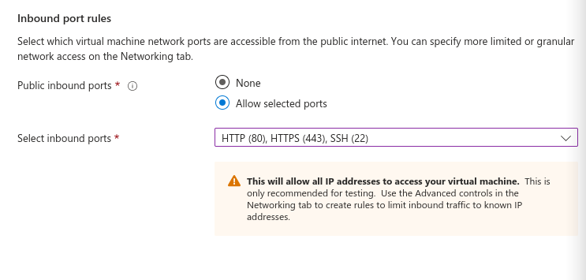
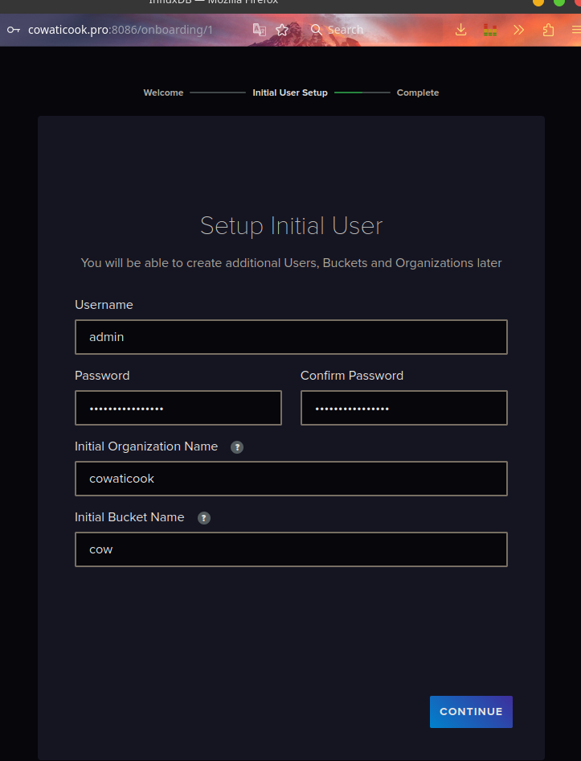

 

# **Installation des logiciels - COWaticook**

---------

<!--ts-->
* [<strong>Installation des logiciels - COWaticook</strong>](#installation-des-logiciels---cowaticook)
   * [Partie 0 - <strong>Création/configuration d'un VPS</strong>](#partie-0---créationconfiguration-dun-vpsi)
      * [Connexion à Azure](#connexion-à-azure)
      * [Création de la machine virtuelle](#création-de-la-machine-virtuelle)
      * [Connexion à la machine virtuelle](#connexion-à-la-machine-virtuelle)
   * [Partie 1](#partie-1)

<!--te-->

## Partie 0 - **Création/configuration d'un VPS**

### Connexion à Azure

Connecter vous au [portail Azure](https://portal.azure.com).

```
> **Note**
> This is a note

> **Warning**
> This is a warning
```
### Création de la machine virtuelle

1. Entrez *machines virtuelles* dans la barre de recherche

2. Sous **Services**, sélectionnez **Virtual machines**.

3. Dans la page **Virtual machines**, sélectionnez **Create** puis **Azure Virtual machine**.

4. Dans l'onglet **Basics**, sous **Project details**, assurez-vous que l'abonnement correct est sélectionné (*Azure for Students*), puis choisissez **Create new** pour créer nouveau groupe de ressources.  Entrez *Cow* comme nom de groupe de ressources.
   

5. Sous **Instance details**, entrez *COWaticookVM* pour le nom de la machine virtuelle et choisissez *Debian 11 "Bullseye" - x64 Gen2* pour votre image. Choisir *(US) East US* ou *(Canada) Canada Central* pour la région. Choisir *Standard* pour le **Security type**. Pour la taille choisir *Standard_B2s* ou *Standard_B1s* (coûte moins chère). Garder le reste des options par défaut.  La disponibilité des tailles et les prix dépendent de votre région et de votre abonnement.
   

6. Sous **Administrator account**, sélectionnez **SSH public key**.

7. Dans **Username**, entrez *cowaticook*.

8. Pour **SSH public key source**, choisissez **Use existing public key**, puis entrez votre clé publique.
   

   > **Note**
   > Si vous n'avez pas de clé publique, vous pouvez en générer une avec la commande `ssh-keygen`. Sinon choisissez **Password** au lieu de **SSH public key**.

9. Sous **Inbound port rules** > **Public inbound ports**, choisissez **Public inbound ports**, puis sélectionnez **SSH (22)**, **HTTP (80)** et **HTTPS (443)** dans la liste déroulante.
   
   
   
10. Laissez les valeurs restantes par défaut, puis sélectionnez **Review + create** en bas de la page.

11. Sur la page **Create a virtual machine**, vous pouvez voir les détails de la machine virtuelle que vous êtes sur le point de créer.  Lorsque vous êtes prêt, sélectionnez **Create**.

12. Une fois le déploiement terminé, sélectionnez **Go to resource**.

13. Sur la page de votre nouvelle VM, sélectionnez l'adresse IP publique et copiez-la dans votre presse-papiers.
    

### Connexion à la machine virtuelle

Si vous êtes sur un ordinateur Mac ou Linux, ouvrez une invite *Bash*. Si vous êtes sur une machine Windows, ouvrez une invite *PowerShell*.

Lancer cette commande pour

   ```bash
   ssh cowaticook@40.117.159.243
   ```

### Mise à jour de la machine virtuelle

1. Mise à jour de la machine virtuelle
   ```bash
   sudo apt update && sudo apt upgrade -y
   ```

2. Changement du fuseau horaire

   ```bash
   sudo dpkg-reconfigure tzdata
   ```

   **Choisir *America/Montreal***

   Vérifier que le fuseau horaire à bien été ajusté 

   ```
   date
   ```

   La sortie de la commande devrait ressembler à ceci : *Tue Apr  4 14:00:29 **EDT** 2023*

   Si le fuseau horaire n'est pas **EDT** ou **EST** alors la commande a échoué

## Partie 1 - Installation des logiciels

#### Installation des dépendances

```bash
sudo apt install -y git apache2 apache2-utils xdg-utils curl docker.io docker-clean docker-compose docker-registry python3-docker python3-certbot-apache certbot wget
```

#### Installation de Node.js avec nvm

1. Installer NVM

   ```bash
   wget -qO- https://raw.githubusercontent.com/nvm-sh/nvm/v0.39.3/install.sh | bash
   ```

2. Installer node.js 18.XX.X avec nvm

   ```bash
   # Source les nouvelles configurations de bash pour activer nvm
   source ~/.bashrc
   
   # Installer la version 18 de node.js
   nvm install --lts
   
   # Utilisation de node.js 18
   nvm use --lts
   ```

3. Vérification de la version de node.js
   ```bash
   # Lancer la commande suivante pour vérifier si Node.js a bien été installé
   node --version
   
   # La sortie de cette commande devrait ressembler à ceci :
   # v18.15.0
   ```

#### Installation de COWaticook-Frontend

Suivre cette [procédure](https://github.com/COWaticook-Team/cowaticook-frontend#utilisation)

#### Installation de InfluxDB

1. Ajouter l'utilisateur dans le groupe *docker* pour qu'il puisse lancer des containers docker

   ```bash
   sudo usermod -aG docker cowaticook
   ```

2. Télécharger le container pour InfluxDB à l'aide du script

   ```bash
   # Lancer cette commande pour télécharger la dernière version du script d'installation
   curl -s https://raw.githubusercontent.com/COWaticook-Team/COWaticook/main/scripts/influxdb-installer.sh | bash
   
   # Le script est égalemment disponible dans le répertoire "scripts" de ce git
   ```

3. Rendez-vous à l'adresse du serveur pour configurer influxdb **http://ip_du_serveur:8086**

4. Entrez ces options:

   - Username : Au choix
   - Password : Au choix (doit être robuste)
   - Initial Organization Name : cowaticook
   - Initial Bucket Name : cow

   

5. Prendre note de la clé pour l'API, elle serra utilisé pour le serveur web (cowaticook-frontend) et le script python (cowaticook-backend) 

#### Installation du Reverse

> **Note**
> Cette étape n'est pas nécessaire si vous n'avez pas de nom de domaine

1. Créer le fichier de config pour cowaticook-frontend
   `sudo vim /etc/apache2/sites-available/cowaticook-frontend.conf`
   Ajouter le texte si dessous
   
   ```html
   <VirtualHost *:80>
           ServerName cowaticook.pro
           ServerAdmin webmaster@localhost
   
           ProxyPreserveHost On
           ProxyRequests Off
           ProxyPass / http://localhost:/
           ProxyPassReverse / http://localhost:3002/
   </VirtualHost>
   ```
   
2. Activation du module pour le proxy

   ```bash
   # Activation du module "proxy"
   sudo a2enmod proxy
   
   # Activation du module "proxy_http"
   sudo a2enmod proxy_http
   
   # Désactivation du site par défaut
   sudo a2dissite 000-default.conf
   
   # Activation du site "cowaticook-frontend" 
   sudo a2ensite pareto.conf
   
   # Activation du site "cowaticook-frontend" 
   sudo a2ensite influx.conf
   
   # Activation du site "cowaticook-frontend" 
   sudo a2ensite cowaticook-frontend.conf
   
   # Redémarre apache2
   sudo systemctl restart apache2
   ```

3. Accéder à la page web pour apache

