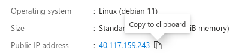

 

# **Installation des logiciels - COWaticook**

---------

<!--ts-->
* [<strong>Installation des logiciels - COWaticook</strong>](#installation-des-logiciels---cowaticook)
   * [Partie 0 - <strong>Création/configuration d'un VPS</strong>](#partie-0---créationconfiguration-dun-vpsi)
      * [Connexion à Azure](#connexion-à-azure)
      * [Création de la machine virtuelle](#création-de-la-machine-virtuelle)
      * [Connexion à la machine virtuelle](#connexion-à-la-machine-virtuelle)
   * [Partie 1](#partie-1)

<!--te-->

## Partie 0 - **Création/configuration d'un VPS**

### Connexion à Azure

Connecter vous au [portail Azure](https://portal.azure.com).

```
> **Note**
> This is a note

> **Warning**
> This is a warning
```

### Création de la machine virtuelle

1. Entrez *machines virtuelles* dans la barre de recherche

2. Sous **Services**, sélectionnez **Virtual machines**.

3. Dans la page **Virtual machines**, sélectionnez **Create** puis **Azure Virtual machine**.  La page Créer une machine virtuelle s'ouvre.

4. Dans l'onglet **Basic**, sous **Project details**, assurez-vous que l'abonnement correct est sélectionné (*Azure for Students*), puis choisissez **Create new** pour créer nouveau groupe de ressources.  Entrez *Cow* comme nom de groupe de ressources.
   

5. Sous **Instance details**, entrez *COWaticookVM* pour le nom de la machine virtuelle et choisissez *Debian 11 "Bullseye" - x64 Gen2* pour votre image. Choisir *(US) East US* ou *(Canada) Canada Central* pour la région. Choisir *Standard* pour le **Security type**. Pour la taille choisir *Standard_B2s* ou *Standard_B1s* (coûte moins chère). Garder le reste des options par défaut.  La disponibilité des tailles et les prix dépendent de votre région et de votre abonnement.
   

6. Sous **Administrator account**, sélectionnez **SSH public key**.

7. Dans **Username**, entrez *cowaticook*.

8. Pour **SSH public key source**, choisissez **Use existing public key**, puis entrez votre clé publique.
   

   > **Note**
   > Si vous n'avez pas de clé publique, vous pouvez en générer une avec la commande `ssh-keygen`. Sinon choisissez **Password** au lied de **SSH public key**.

9. Sous **Inbound port rules** > **Public inbound ports**, choisissez **Public inbound ports**, puis sélectionnez **SSH (22)**, **HTTP (80)** et **HTTPS (443)** dans la liste déroulante.
   
   
   
10. Laissez les valeurs par défaut restantes, puis sélectionnez le bouton **Review + create** en bas de la page.

11. Sur la page **Create a virtual machine**, vous pouvez voir les détails de la machine virtuelle que vous êtes sur le point de créer.  Lorsque vous êtes prêt, sélectionnez **Create**.

12. Une fois le déploiement terminé, sélectionnez **Go to resource**.

13. Sur la page de votre nouvelle VM, sélectionnez l'adresse IP publique et copiez-la dans votre presse-papiers.
    

### Connexion à la machine virtuelle

Si vous êtes sur un ordinateur Mac ou Linux, ouvrez une invite Bash. Si vous êtes sur une machine Windows, ouvrez une invite PowerShell.
   ```bash
   ssh cowaticook@40.117.159.243
   ```

## Partie 1

